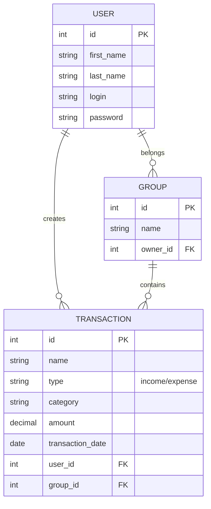

# 💸 Приложение для отслеживания расходов

Приложение для управления личными финансами, позволяющее пользователям фиксировать доходы и расходы и получать аналитику по ним. 📊

## ✨ Функции

- ➕ Добавление транзакций;
- 📈 Аналитика по категориям и периодам;
- 🥧 Визуализация данных;
- 🧹 Сортировка транзакций по дате и категориям;
- 📤 Экспорт данных в `.csv` и `.xlsx`;
- ⏰ Напоминания о регулярных платежах.

## 🏗️ Архитектура

### 🗄️ База данных

### 🌐 API

#### 🔐 Аутентификации

- 📝 Регистрация
- 🔑 Аутентификация
- 🔁 Обновление токена
- 🔒 Смена пароля

#### 💼 Транзакции

- ➕ Создание
- ✏️ Редактирование
- 🗑️ Удаление
- 📚 Чтение

#### 👥 Группы

- ➕ Создание
- ✏️ Редактирование
- 🗑️ Удаление
- 📚 Чтение
- 📊 Аналитика
