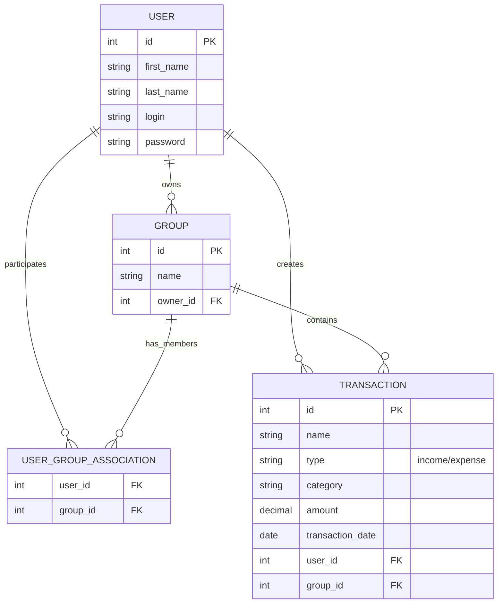

# 💸 Приложение для отслеживания расходов

Приложение для управления личными финансами, позволяющее пользователям фиксировать доходы и расходы и получать аналитику по ним. 📊

## ✨ Функции

- ➕ Добавление транзакций;
- 📈 Аналитика по категориям и периодам;
- 🥧 Визуализация данных;
- 🧹 Сортировка транзакций по дате и категориям;
- 📤 Экспорт данных в `.csv` и `.xlsx`;
- ⏰ Напоминания о регулярных платежах.

## 🏗️ Архитектура

### 🌐 API

#### 🔐 Аутентификации

| Эндпоинт               | Метод | Описание                    | Путь                      |
| ---------------------- | ----- | --------------------------- | ------------------------- |
| Регистрация            | POST  | Создать нового пользователя | /api/auth/register        |
| Авторизация            | POST  | Вход и получение токенов    | /api/auth/login           |
| Просмотр пользователя  | GET   | Просмотр пользователя       | /api/auth/me              |
| Смена пароля           | PUT   | Смена пароля                | /api/auth/change-password |
| Обновление токена      | POST  | Обновить токена             | /api/auth/refresh-token   |

#### 👥 Группы

| Эндпоинт               | Метод  | Описание                       | Путь                                   |
| ---------------------- | ------ | ------------------------------ | -------------------------------------- |
| Получить список        | GET    | Список групп пользователя      | /api/groups                            |
| Создать группу         | POST   | Создать новую группу           | /api/groups                            |
| Редактировать группу   | PUT    | Обновить данные группы         | /api/groups/{group_id}                 |
| Удалить группу         | DELETE | Удалить группу                 | /api/groups/{group_id}                 |
| Посмотреть группу      | GET    | Посмотреть данные группы       | /api/groups/{group_id}                 |
| Добавить пользователя  | POST   | Добавить пользователя в группу | /api/groups/{group_id}/users/{user_id} |
| Удалить пользователя   | DELETE | Удалить пользователя из группы | /api/groups/{group_id}/users/{user_id} |
| Список пользователей   | GET    | Список пользователей группы    | /api/groups/{group_id}/users           |
| Получить аналитику     | GET    | Аналитика по расходам в группе | /api/groups/{id}/analytics             |

#### 💼 Транзакции

| Эндпоинт                 | Метод  | Описание                                   | Путь                   |
| ------------------------ | ------ | ------------------------------------------ | ---------------------- |
| Получить список          | GET    | Список транзакций с пагинацией и фильтрами | /api/transactions      |
| Создать транзакцию       | POST   | Добавить доход или расход                  | /api/transactions      |
| Редактировать транзакцию | PUT    | Обновить данные транзакции                 | /api/transactions/{id} |
| Удалить транзакцию       | DELETE | Удалить транзакцию                         | /api/transactions/{id} |

### 🗄️ База данных



## 🚀 Запуск проекта

### Вариант 1: Запуск в Docker

1. Клонирование репозитория
```bash
git clone git@github.com:MIPT-PD-PP-1/finance-tracker.git
cd finance-tracker
```

2. Настройка переменных окружения
```bash
cp .env.example .env
```

Отредактируйте `.env` при необходимости.

3. Сборка и запуск
```bash
docker compose up -d --build
```

4. Проверка состояния
```bash
docker compose ps
```

5. Остановка
```bash
docker compose down
```

### Вариант 2: Локальный запуск для разработки

1. Клонирование репозитория
```bash
git clone git@github.com:MIPT-PD-PP-1/finance-tracker.git
cd finance-tracker
```

2. Настройка переменных окружения
```bash
cp .env.example .env
```

Отредактируйте `.env` при необходимости.

При первом запуске на основе `.env` будет создан `.env.local`.

3. Запуск приложения
```bash
make run
```

4. Остановка
- Нажмите `Ctrl+C` для остановки приложения
- Для остановки базы данных выполните: `make db-down`

